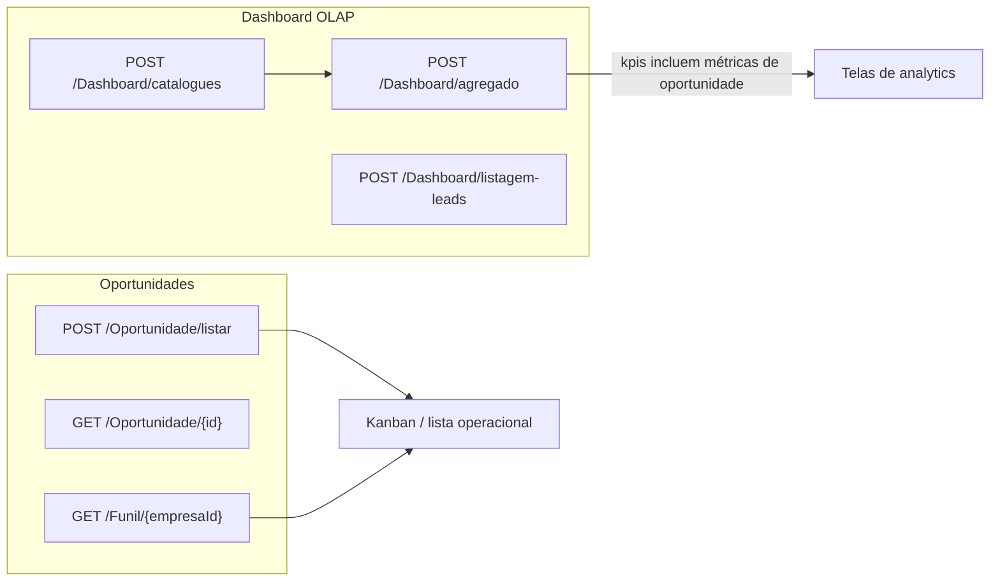

# Artefato frontend: OLAP (Dashboard) e Oportunidades

Documento de referência para implementação do frontend alinhado à API **WebsupplyConnect**. Cobre o **Dashboard analítico (OLAP)** e o **módulo de Oportunidades**, incluindo permissões, contratos de request/response e fluxos recomendados.

**Base URL:** `{API_BASE}/api/...` (ex.: `/api/Dashboard/agregado`).

**Autenticação:** Bearer JWT em todos os endpoints listados (exceto onde indicado). Policy global: `HorarioTrabalho`.

---

## 1. Visão geral da arquitetura

| Domínio | Papel no produto | Origem dos dados |
|--------|-------------------|------------------|
| **Dashboard OLAP** | KPIs, gráficos e listagens analíticas de leads/campanhas; métricas de **pipeline e conversão de oportunidades** nos KPIs agregados | Cubo OLAP (fatos + dimensões), ETL |
| **Oportunidades** | CRUD operacional, funil por empresa, histórico de etapas, integrações (Gold/NBS, conversão) | Banco transacional |

**Relação conceitual:** Os campos `OportunidadesAbertas`, `OportunidadesGanhas`, `OportunidadesPerdidas`, `ValorTotalPipeline` e `ValorTotalGanho` no bloco `geral.kpis` do dashboard vêm do **OLAP** (agregação sobre fatos de oportunidade), não do endpoint de listagem de oportunidades. O front pode cruzar **analytics (OLAP)** com **detalhe (Oportunidade)** navegando por `leadId` / empresa quando fizer sentido na UX.



---

## 2. Dashboard OLAP (`DashboardController`)

### 2.1 Formato de resposta

- Endpoints **`/api/Dashboard/*`** (agregado, catálogos, listagens paginadas, home, etc.) retornam em geral **o DTO direto** no body HTTP 200 (`Content-Type: application/json`), **sem** envelope `ApiResponse` — exceto quando documentado como erro padronizado (ver §2.5).
- Endpoints de **Oportunidade / Funil / Etapa** usam **`ApiResponse<T>`** (`success`, `message`, `data`, `error`).

### 2.2 Permissões

| Permissão | Uso |
|-----------|-----|
| `DASHBOARD_VER` | `POST /agregado`, `POST /listagem-leads`, `POST /leads-por-vendedor`, `POST /leads-aguardando-*`, ETL `POST /etl/reprocessar`, `GET /ultima-atualizacao` (quando aplicável à regra do controller). Se o filtro **não** incluir `empresaIds`, a API pode exigir permissão global; com empresas selecionadas, valida **por empresa**. |
| (nenhuma extra) | `POST /catalogues` — catálogo considera empresas vinculadas ao usuário (`UsuarioEmpresa`); o body `empresaIds` é **ignorado** de propósito. |
| Home / acompanhamento | Vários endpoints `home-*` **não** exigem `DASHBOARD_VER` no mesmo caminho que o agregado analítico; ver comentários no controller — ainda assim aplicam escopo de empresa e vínculos. |
| `home-conversa-contexto-categoria-ia` | Exige `DASHBOARD_VER`. |

### 2.3 Enum `TipoPeriodo` (`TipoPeriodoEnum`)

Valores numéricos enviados em JSON:

| Valor | Nome |
|------:|------|
| 1 | `Ultimos7Dias` |
| 2 | `Ultimos30Dias` |
| 3 | `EsteMes` |
| 4 | `EsteTrimestre` |
| 5 | `EsteAno` |
| 6 | `Customizado` |
| 7 | `Hoje` |
| 8 | `EstaSemana` |

- Se `tipoPeriodo === 6` (**Customizado**): enviar `dataInicio` e `dataFim` (obrigatórios). Janela máxima: **366 dias**; `dataInicio` não pode ser posterior a `dataFim`.
- Período é resolvido no servidor com **fuso de Brasília** para consistência com os dados.

### 2.4 Filtros multi-seleção (`DashboardFiltrosRequestDTO`)

Campos principais do body em `POST /api/Dashboard/agregado` e endpoints que reutilizam o mesmo validador:

| Campo JSON | Tipo | Notas |
|------------|------|--------|
| `tipoPeriodo` | `number \| null` | Obrigatório para agregado/listagens que exigem período |
| `dataInicio`, `dataFim` | `string` (ISO date) | Obrigatórios se customizado |
| `empresaIds`, `equipeIds`, `vendedorIds`, `origemIds`, `campanhaIds` | `number[]` | IDs de **origem transacional** onde aplicável (equipe = `equipeOrigemId`, vendedor = `usuarioOrigemId`, campanha = `campanhaOrigemId`, origem = `origemOrigemId`) — alinhados ao catálogo |
| `statusLeadId`, `statusLeadIds` | `number` / `number[]` | Status na dimensão OLAP |
| `funilId`, `funilIds` | `number` / `number[]` | IDs transacionais de **Funil** (filtra oportunidades nas etapas desse funil) |
| `etapaId`, `etapaIds` | `number` / `number[]` | IDs transacionais de **Etapa** (filtra por etapa específica; pode combinar com `funilIds`) |
| `vendedorId` | `number` | Obrigatório em `POST /leads-por-vendedor` (clique no vendedor na aba Equipes) |
| `pagina`, `tamanhoPagina` | `number` | Obrigatórios onde a rota exige paginação: página ≥ 1, tamanho 1–200 |
| `ordenarPor`, `direcaoOrdenacao` | `string` | Ex.: `dataUltimoEvento`, `nome`, `nomeOrigem`; direção `asc` / `desc` |

**Catálogo (`POST /api/Dashboard/catalogues`):** body opcional; retorna `empresas` (árvore com `equipes` e `vendedores`), `statusLeads`, `origens`, `campanhas`. Use para montar filtros. IDs de vendedor no catálogo = **usuarioId de origem** (campo `id` em `DashboardCatalogoVendedorDTO`).

**Campanhas disponíveis por período (`POST /api/Dashboard/catalogues/campanhas-disponiveis`):** usa os mesmos filtros de período/escopo do dashboard e retorna apenas campanhas que tenham leads no recorte atual. Indicado para popular o dropdown de campanhas de forma dinâmica após seleção de período/empresa/equipe/vendedor/origem.

### 2.5 Resposta agregada — estrutura (`DashboardAgregadoDTO`)

Chamada única recomendada ao abrir o dashboard ou ao mudar qualquer filtro; **troca de aba** não exige nova chamada se os dados já estiverem em memória.

```json
{
  "geral": {
    "kpis": {
      "totalLeads": 0,
      "leadsConvertidos": 0,
      "oportunidadesAbertas": 0,
      "oportunidadesGanhas": 0,
      "oportunidadesPerdidas": 0,
      "valorTotalPipeline": 0,
      "valorTotalGanho": 0,
      "taxaConversao": 0,
      "tempoMedioRespostaMinutos": 0
    },
    "tempoResposta": {},
    "conversoesSemana": [],
    "insights": {},
    "funilOportunidadesPorEtapa": [
      {
        "etapaId": 0,
        "funilId": 0,
        "nomeEtapa": "",
        "nomeFunil": "",
        "ordem": 0,
        "cor": "",
        "quantidadeOportunidades": 0,
        "quantidadeLeadsDistintos": 0,
        "valorPipeline": 0
      }
    ]
  },
  "equipes": {
    "performanceVendedores": [],
    "performanceEquipes": [],
    "atividadePorHorario": []
  },
  "leads": {
    "leadsPorStatus": [],
    "leadsPorOrigem": [],
    "leadsPorCampanha": [],
    "evolucaoLeadsStatus": [],
    "leadsCriadosPorHorario": []
  },
  "campanhas": {
    "campanhasPerformance": {},
    "eventosPorCampanha": [],
    "leadsConvertidosPorCampanha": [],
    "funilCampanha": {},
    "conversaoGeral": {},
    "engajamentoPorCampanha": [],
    "eventosLeadPorHorarioCampanha": {}
  },
  "ultimaAtualizacao": null
}
```

Os tipos detalhados dos arrays/objetos aninhados estão em `src/WebsupplyConnect.Application/DTOs/Dashboard/*.cs` (ex.: `DashboardPerformanceVendedorDTO`, `DashboardCampanhaPerformanceDTO`).

**Funil de vendas (`geral.funilOportunidadesPorEtapa`):** lista agregada por **etapa do funil** configurada por empresa. Usa o fato OLAP `FatoOportunidadeMetrica` com dimensão de etapa; aplica o mesmo período e filtros do dashboard, deduplica por **oportunidade** (último snapshot no intervalo, alinhado aos KPIs). Métricas: `quantidadeOportunidades` (negócios na etapa), `quantidadeLeadsDistintos` (`COUNT(DISTINCT leadId)`), `valorPipeline` (soma de `valorEstimado` para oportunidades ainda abertas — não ganhas e não perdidas). Etapas sem oportunidades no recorte filtrado podem não aparecer. Após deploy, execute ETL para preencher dimensões e fatos.

### 2.6 Rotas principais do Dashboard

| Método | Rota | Descrição |
|--------|------|-----------|
| `POST` | `/api/Dashboard/catalogues` | Filtros (empresas → equipes → vendedores) + status, origens, campanhas |
| `POST` | `/api/Dashboard/catalogues/campanhas-disponiveis` | Dropdown de campanhas por período/escopo (somente campanhas com leads no recorte) |
| `POST` | `/api/Dashboard/agregado` | Payload completo das 4 abas (Geral, Equipes, Leads, Campanhas) |
| `POST` | `/api/Dashboard/listagem-leads` | Tabela paginada de leads (aba Leads) |
| `POST` | `/api/Dashboard/leads-por-vendedor` | Paginação; exige `vendedorId` |
| `POST` | `/api/Dashboard/leads-aguardando-atendimento` | Sem filtro de período; `DashboardLeadsAguardandoRequestDTO` |
| `POST` | `/api/Dashboard/leads-aguardando-resposta` | Idem |
| `GET` | `/api/Dashboard/ultima-atualizacao` | Data/status da última carga OLAP |
| `POST` | `/api/Dashboard/etl/reprocessar?dataInicio=&dataFim=` | Admin: reprocessar ETL (máx. 365 dias) |
| `POST` | `/api/Dashboard/home-agregado` | KPIs da home (acompanhamento) |
| `POST` | `/api/Dashboard/home-leads-pendentes` | Lista paginada de pendentes |
| `POST` | `/api/Dashboard/home-leads-primeiro-atendimento-aguardando-cliente` | Paginado |
| `POST` | `/api/Dashboard/home-conversas-ativas` | Paginado |
| `POST` | `/api/Dashboard/home-conversa-contexto-categoria-ia` | Body: `{ "conversaId": 0 }` |

**Paginação padrão (OLAP):** resposta `PagedResultDTO<T>`:

```ts
interface PagedResultDTO<T> {
  itens: T[];
  paginaAtual: number;
  tamanhoPagina: number;
  totalItens: number;
  totalPaginas: number;
}
```

### 2.7 Erros comuns (Dashboard)

- **400** `DASHBOARD_INVALID_PAYLOAD` — payload ou `tipoPeriodo` ausente.
- **422** `DASHBOARD_INVALID_DATE_RANGE` — intervalo customizado inválido ou > 366 dias.
- **400** `DASHBOARD_INVALID_PAGINATION` — `pagina`/`tamanhoPagina` ausentes ou fora do intervalo.
- **400** `PERMISSAO_NEGADA` — sem `DASHBOARD_VER` ou sem permissão na empresa filtrada.
- **400** `DASHBOARD_FORBIDDEN_FILTER_SCOPE` — mensagem detalhada após ` | ` (empresa/equipe/vendedor/campanha/origem fora do escopo). O front pode fazer `error.split(" | ", 2)` para código + detalhe.

### 2.8 Contrato frontend — campanhas por período (dropdown)

Endpoint recomendado para abastecer o filtro de campanhas sem opções "vazias" no contexto atual:

- `POST /api/Dashboard/catalogues/campanhas-disponiveis`
- Mesmo modelo de autenticação/permissão das rotas analíticas do dashboard.
- Reaproveita as validações padrão de período, escopo e permissões por empresa.

**Request (`DashboardFiltrosRequestDTO`)**

```json
{
  "tipoPeriodo": 6,
  "dataInicio": "2026-03-01",
  "dataFim": "2026-03-27",
  "empresaIds": [1],
  "equipeIds": [10],
  "vendedorIds": [101, 102],
  "origemIds": [3, 5]
}
```

Observações:

- `tipoPeriodo` é obrigatório; se `6` (customizado), `dataInicio` e `dataFim` são obrigatórios.
- `campanhaIds` não precisa ser enviado nessa chamada (o objetivo é descobrir campanhas disponíveis).
- `statusLeadIds`, `funilIds` e `etapaIds` podem ser enviados se a UX desejar sincronizar 100% com o restante dos filtros avançados.

**Response (`DashboardCampanhaDisponivelDTO[]`)**

```json
[
  {
    "campanhaId": 9001,
    "nomeCampanha": "Campanha Outono 2026",
    "empresaId": 1,
    "quantidadeLeads": 47
  },
  {
    "campanhaId": 9010,
    "nomeCampanha": "Reativação Base Março",
    "empresaId": 1,
    "quantidadeLeads": 12
  }
]
```

Sem resultados:

```json
[]
```

Guia rápido de aplicação no frontend:

1. Carregar `catalogues` para montar árvore base de filtros.
2. Sempre que mudar período/escopo (empresa, equipe, vendedor, origem), chamar `catalogues/campanhas-disponiveis`.
3. Popular o dropdown com o retorno e opcionalmente exibir `quantidadeLeads` no label.
4. Se a campanha selecionada não vier mais no retorno, limpar seleção e avisar o usuário de forma não bloqueante.
5. Só então disparar `agregado`/demais endpoints com o estado de filtros atualizado.

---

## 3. Oportunidades (`OportunidadeController`, `FunilController`, `EtapaController`)

### 3.1 Envelope `ApiResponse<T>`

```json
{
  "success": true,
  "message": "Sucesso",
  "data": {},
  "error": null
}
```

Erros: `success: false`, `message` descritivo, `error` opcional (detalhe técnico).

### 3.2 Permissões (strings exatas)

| Permissão | Operação |
|-----------|----------|
| `OPORTUNIDADE_CRIAR` | `POST /api/Oportunidade/criar` |
| `OPORTUNIDADE_VISUALIZAR` | Listar/visualizar **próprias** oportunidades (`responsavelId` = usuário logado) |
| `OPORTUNIDADE_VISUALIZAR_TODAS` | Filtros com responsável diferente do usuário |
| `OPORTUNIDADE_EDITAR` | Atualizar quando `dto.responsavelId` = usuário |
| `OPORTUNIDADE_EDITAR_TODAS` | Atualizar oportunidades de outros responsáveis |
| `OPORTUNIDADE_EXCLUIR` | `DELETE` |
| `OPORTUNIDADE_MOVER_ETAPAS` | `PATCH .../mover-etapa` |
| `OPORTUNIDADE_ENVIAR_GOLD` | `PATCH .../converter-gold` |

### 3.3 Rotas e contratos

| Método | Rota | Body / query | `data` em sucesso |
|--------|------|--------------|-------------------|
| `POST` | `/api/Oportunidade/criar` | `CreateOportunidadeDTO` | `{}` (vazio) + mensagem |
| `POST` | `/api/Oportunidade/listar` | `FilterOportunidadeDTO` | `OportunidadePaginadoDTO` |
| `GET` | `/api/Oportunidade/{id}` | — | `GetOportunidadeDTO` |
| `PUT` | `/api/Oportunidade/atualizar` | `UpdateOportunidadeDTO` | `{}` |
| `DELETE` | `/api/Oportunidade/{id}?empresaId=` | query `empresaId` obrigatória | `{}` |
| `PATCH` | `/api/Oportunidade/{oportunidadeId}/mover-etapa` | `ChangeEtapaDTO` | `{}` |
| `PATCH` | `/api/Oportunidade/{oportunidadeId}/converter-gold` | — | `{}` |
| `GET` | `/api/Oportunidade/tipos-interesse` | — | `TipoInteresseDTO[]` |
| `POST` | `/api/Oportunidade/conversao` | `ConversaoOportunidadeDTO` | **ApiKey** + `AllowAnonymous` — integração externa |
| `GET` | `/api/Funil/{empresaID}` | — | `GetEtapasDTO[]` |
| `GET` | `/api/Etapa/{oportunidadeId}` | — | `EtapaHistoricoListDTO[]` |

### 3.4 DTOs resumidos (referência rápida)

**CreateOportunidadeDTO**

- `leadId`, `produtoId`, `etapaId`, `origemId`, `empresaId` (obrigatórios conforme regra de negócio)
- `valor`, `tipoInteresseId`, `observacao`, `dataPrevisaoFechamento`, `leadEventoId` opcionais

**FilterOportunidadeDTO**

- Filtros opcionais: `leadId`, `produtoId`, `etapaId`, `valorMinimo`, `valorMaximo`, `responsavelId`, `origemId`, `empresaId`, `dataPrevisaoFechamento`, `dataInicio`, `dataFim`
- **Obrigatórios:** `pagina`, `tamanhoPagina`

**GetOportunidadeDTO** (detalhe)

- Identificação: `id`, `leadId`, `nomeLead`, `produtoId`, `nomeProduto`, `etapaId`, `nomeEtapa`, `responsavelId`, `nomeResponsavel`, `empresaId`, `nomeEmpresa`, `origemId`, `nomeOrigem`
- Negócio: `valor`, `valorFinal`, `probabilidade`, `tipoInteresseId`, `nomeInteresse`, `nivelInteresse`, `observacoes`, `dataPrevisaoFechamento`, `dataFechamento`, `dataUltimaInteracao`, `dataCriacao`
- Integrações: `codEventoNBS`, `convertidaNBS`, `temEvento`, `idEvento`, `campanhaDoEventoNome`, `canalDoEvento`, `observacaoDoEvento`

**UpdateOportunidadeDTO**

- `id`, `responsavelId`, `empresaId` + campos opcionais de atualização (produto, valor, probabilidade, datas, etc.)

**ChangeEtapaDTO**

- `etapaDestinoId`, `empresaId`
- `valorFinalVenda` obrigatório se etapa de vitória
- `observacao` obrigatória em perda, reabertura, regressão (conforme regra de negócio no serviço)

**ConversaoOportunidadeDTO** (webhook/API key)

- `oportunidadeId`, `convertida`, `dataConversao`

---

## 4. Checklist de implementação frontend

1. **Dashboard:** carregar `catalogues` uma vez (ou ao mudar contexto de usuário), depois `agregado` com filtros; debounce em mudanças de filtro.
2. **Sincronizar IDs:** usar do catálogo os mesmos IDs de origem que o backend valida (`equipeOrigemId`, `usuarioOrigemId`, etc.).
3. **Listagem de leads:** `listagem-leads` com `pagina`/`tamanhoPagina` + mesmos filtros dimensionais.
4. **Drill-down vendedor:** `leads-por-vendedor` com `vendedorId` = `DashboardPerformanceVendedorDTO.vendedorId` (conforme retorno real do DTO no backend).
5. **Oportunidades:** ao montar kanban/lista, chamar `Funil/{empresaId}` para etapas; `listar` com paginação; detalhe via `GET /{id}`.
6. **Permissões:** esconder ações (criar, editar todas, mover, gold, excluir) conforme claims/permissões por empresa.
7. **Erros de escopo:** tratar `DASHBOARD_FORBIDDEN_FILTER_SCOPE` sem deslogar o usuário (400 de negócio, não 401).
8. **Funil por etapa:** usar `geral.funilOportunidadesPorEtapa` do `agregado`; filtros opcionais `funilIds` / `etapaIds` com os mesmos IDs do `GET /api/Funil/{empresaId}` (etapas) e da entidade transacional `Funil`.

---

## 5. Referência de código-fonte (backend)

| Área | Caminho |
|------|---------|
| Rotas Dashboard | `src/WebsupplyConnect.API/Controllers/Dashboard/DashboardController.cs` |
| Agregado e DTOs | `src/WebsupplyConnect.Application/DTOs/Dashboard/DashboardAgregadoDTO.cs`, `DashboardFunilOportunidadesPorEtapaDTO.cs` |
| Filtros / período | `src/WebsupplyConnect.Application/DTOs/Dashboard/FiltrosDashboardDTO.cs`, `DashboardFiltrosRequestDTO.cs` |
| Serviço OLAP | `src/WebsupplyConnect.Application/Services/OLAP/OLAPConsultaService.cs` |
| Dimensões / ETL funil-etapa | `src/WebsupplyConnect.Application/Services/ETL/ETLDimensoesService.cs`, `ETLFatosService.cs` |
| Entidades OLAP | `src/WebsupplyConnect.Domain/Entities/OLAP/Dimensoes/DimensaoFunil.cs`, `DimensaoEtapaFunil.cs` |
| Migration | `src/WebsupplyConnect.Infrastructure/Data/Migrations/20260326202939_AddOlapDimensaoFunilEtapa.cs` |
| Oportunidade API | `src/WebsupplyConnect.API/Controllers/Oportunidade/OportunidadeController.cs` |
| DTOs Oportunidade | `src/WebsupplyConnect.Application/DTOs/Oportunidade/*.cs` |

---

*Gerado a partir do código do repositório; em caso de divergência, prevalece a implementação na API.*
